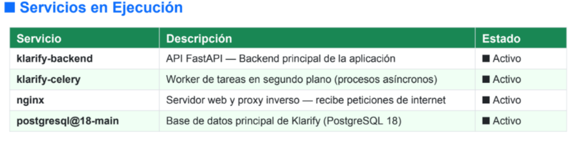
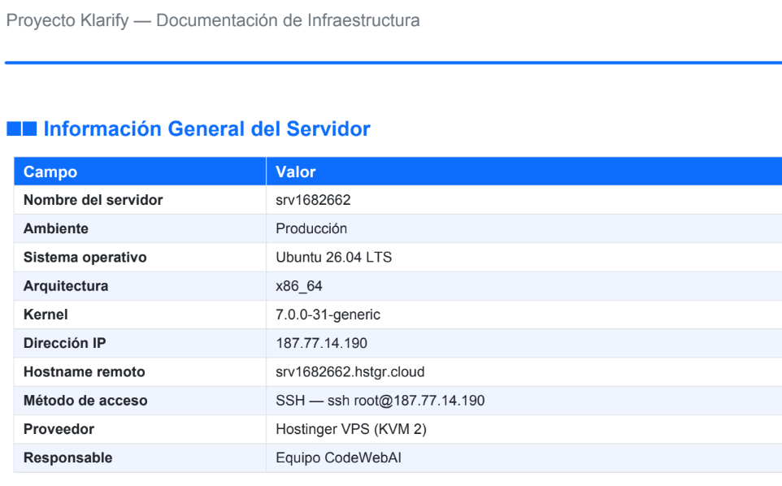

# 4. Despliegues y Servidores

## 4.1 Objetivo

Establecer los lineamientos generales para la administración de servidores y el despliegue de aplicaciones desarrolladas por CodeWebAI, con el propósito de mantener un proceso organizado, seguro, reproducible y controlado.

Este estándar define las consideraciones básicas relacionadas con el entorno de servidores, el sistema operativo utilizado, el acceso remoto mediante SSH y las buenas prácticas que deberán seguirse durante las actividades de despliegue y mantenimiento.

El objetivo principal es reducir errores durante la publicación de cambios y asegurar que las modificaciones realizadas por los desarrolladores se incorporen al entorno correspondiente de manera controlada.

---

## 4.2 Alcance

Este estándar aplica a los desarrolladores y personal autorizado que intervienen en actividades relacionadas con:

* Administración de servidores.
* Configuración de ambientes.
* Despliegue de aplicaciones.
* Actualización de código.
* Mantenimiento de servicios.
* Consulta de registros y archivos de configuración.
* Acceso remoto a servidores.
* Validación de aplicaciones después de un despliegue.

Las actividades administrativas deberán realizarse únicamente sobre los servidores y ambientes autorizados por CodeWebAI.

---

## 4.3 Entorno de servidores

Los servidores constituyen el entorno donde se alojan y ejecutan las aplicaciones y servicios requeridos por los proyectos.


La infraestructura deberá mantenerse organizada de acuerdo con los ambientes definidos para cada proyecto. Cuando corresponda, se recomienda diferenciar los ambientes de desarrollo, pruebas y producción para evitar que modificaciones en desarrollo afecten directamente a los servicios utilizados por los usuarios finales.

La información de cada servidor deberá mantenerse documentada, considerando como mínimo.

Ejemplo del proyecto de Klarify

{: left="100px"}

Las especificaciones particulares de cada servidor deberán mantenerse actualizadas en la documentación interna correspondiente.

---

## 4.4 Sistema operativo

Los servidores utilizados para los proyectos podrán utilizar **Ubuntu Linux** como Sistema Operativo base, de acuerdo con las necesidades y características de cada infraestructura.

Ubuntu proporciona un entorno estable para la ejecución y administración de aplicaciones y servicios, además de permitir la gestión mediante herramientas de línea de comandos.

La versión específica del sistema operativo deberá quedar registrada para cada servidor.

Para consultar la información del sistema se pueden utilizar los siguientes comandos:

```bash
lsb_release -a
```

o:

```bash
cat /etc/os-release
```

También se puede consultar la arquitectura y la información general del kernel mediante:

```bash
uname -a
```

### Información mínima a documentar

{: left="100px"}

> **Nota:** Verificar la version de Ubuntu.

---

## 4.5 Acceso al servidor mediante SSH

El acceso remoto a los servidores se realizará mediante **SSH (Secure Shell)** cuando este mecanismo se encuentre habilitado y autorizado.

SSH permite establecer una conexión remota segura entre el equipo del desarrollador y el servidor mediante un canal de comunicación cifrado.

La estructura general del comando es:

```bash
ssh usuario@servidor
```

Por ejemplo:

```bash
ssh usuario@192.168.1.100
```

La dirección utilizada anteriormente es únicamente un ejemplo.

Para realizar una conexión real se deberá utilizar el usuario y la dirección correspondientes al servidor autorizado.

### Verificación de la conexión

Una vez establecida la conexión con .env, se recomienda comprobar la identidad del usuario y del servidor antes de realizar cualquier modificación.

Para verificar el usuario:

```bash
whoami
```

Para verificar el nombre del servidor:

```bash
hostname
```

Para consultar información del sistema:

```bash
uname -a
```

Estas comprobaciones permiten reducir el riesgo de ejecutar cambios en un servidor o ambiente diferente al previsto.

---

## 4.6 Proceso general de despliegue

El proceso de despliegue deberá realizarse de manera controlada y siguiendo las etapas definidas por el equipo.

De manera general, el flujo puede representarse de la siguiente forma:

```text
Desarrollo
    ↓
Control de versiones
    ↓
Revisión de cambios
    ↓
Validación
    ↓
Preparación del despliegue
    ↓
Acceso al servidor
    ↓
Actualización de la aplicación
    ↓
Configuración / dependencias
    ↓
Pruebas posteriores
    ↓
Validación del servicio
```

Cada proyecto podrá requerir pasos adicionales dependiendo de las tecnologías utilizadas.

### 4.6.1 Preparación

Antes de realizar un despliegue se deberán revisar los cambios que serán incorporados y confirmar que correspondan a la versión que se desea publicar.

Se deberá verificar, cuando aplique:

* Rama correspondiente.
* Commit o versión a desplegar.
* Dependencias requeridas.
* Variables de entorno.
* Configuraciones necesarias.
* Migraciones de base de datos.
* Servicios involucrados.

### 4.6.2 Acceso al servidor

El desarrollador autorizado deberá conectarse al servidor mediante el mecanismo establecido, por ejemplo:

```bash
ssh usuario@servidor
```

Antes de ejecutar modificaciones se deberá verificar:

```bash
whoami
hostname
```

### 4.6.3 Actualización de la aplicación

La actualización deberá realizarse siguiendo el procedimiento definido para el proyecto.

Cuando el proyecto utilice Git como sistema de control de versiones, los cambios podrán obtenerse desde el repositorio remoto utilizando las instrucciones establecidas por el equipo.

No deberán realizarse modificaciones manuales sobre archivos de producción que no formen parte del procedimiento autorizado.

### 4.6.4 Instalación o actualización de dependencias

Cuando el despliegue requiera nuevas dependencias, estas deberán instalarse siguiendo el administrador de paquetes o herramienta correspondiente a la tecnología utilizada o al proyecto en desarrollo.

Las dependencias deberán mantenerse registradas en los archivos correspondientes del proyecto para facilitar la reproducción del entorno.

### 4.6.5 Validación posterior al despliegue

Después de realizar un despliegue se deberán realizar las validaciones necesarias para comprobar que la aplicación continúa funcionando correctamente.

Dependiendo del proyecto, estas pueden incluir:

* Acceso a la aplicación.
* Validación de funcionalidades principales.
* Comprobación de servicios.
* Revisión de registros.
* Validación de conexión con bases de datos.
* Verificación de errores.

---

## 4.7 Buenas prácticas de despliegue

Para mantener un proceso seguro y ordenado se establecen las siguientes buenas prácticas:

1. **No desplegar cambios directamente sin revisión previa.**

2. **Verificar siempre el ambiente antes de realizar modificaciones.**

3. **Confirmar el servidor mediante `hostname` antes de ejecutar comandos administrativos.**

4. **Mantener respaldos o mecanismos de recuperación cuando el cambio pueda afectar información o servicios.**

5. **No almacenar contraseñas, tokens, claves privadas u otras credenciales dentro del código fuente.**

6. **No compartir credenciales de acceso al servidor.**

7. **Realizar únicamente las modificaciones necesarias para el despliegue.**

8. **Registrar cambios relevantes realizados sobre el servidor.**

9. **Validar la aplicación después de cada despliegue.**

10. **Evitar realizar cambios directamente en producción sin autorización.**

11. **Mantener separadas las configuraciones correspondientes a cada ambiente.**

12. **Utilizar versiones controladas del código y de las dependencias.**

---

## 4.8 Seguridad de acceso

El acceso a los servidores deberá estar limitado al personal autorizado.

Las credenciales y mecanismos de autenticación deberán mantenerse bajo controles de seguridad adecuados.

No deberán almacenarse en repositorios públicos o archivos del proyecto:

```text
Contraseñas
Tokens
Claves privadas
Credenciales de bases de datos
Llaves API
Variables sensibles
```

Cuando sea posible, se recomienda utilizar mecanismos de autenticación mediante claves SSH y administrar los permisos de acuerdo con el principio de mínimo privilegio.

Los usuarios deberán contar únicamente con los permisos necesarios para realizar las actividades asignadas.

---

### Nota
Cualquier modificación a la infraestructura, configuración de servicios o procedimiento de despliegue deberá realizarse conforme a las autorizaciones y políticas internas establecidas por CodeWebAI.
