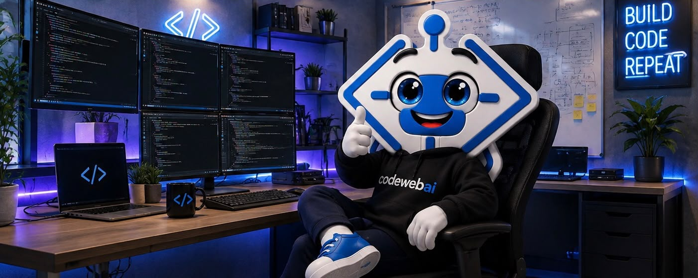

---
hide:
  - navigation
  - toc
---

# Bienvenidos a la Documentación de CodeWebAI

{: width="960px"}

El objetivo principal de este portal es centralizar, organizar y estandarizar todo el conocimiento técnico y operativo de **CodeWebAI**. 

Sabemos que nuestro mayor activo como equipo de ingeniería es la información compartida. Esta plataforma está diseñada para ser nuestra **fuente única de verdad**, facilitando la integración de nuevos colaboradores, optimizando nuestros flujos de trabajo diarios y asegurando la mantenibilidad y escalabilidad de todas nuestras soluciones.

## ¿Qué encontrarás en este portal?

Nuestra documentación está estructurada de manera lógica para que encuentres exactamente lo que necesitas en el momento adecuado. Puedes navegar a través del menú superior para acceder a las siguientes secciones:

* **[Desarrollo](primeros-pasos/index.md):** Guías técnicas detalladas sobre nuestro stack tecnológico y operaciones de infraestructura. Aquí documentamos nuestros procesos de despliegue continuo (CI/CD) en Vercel, administración de dominios, gestión de entornos virtuales y monitoreo de servidores mediante herramientas como PM2. También abarcamos los lineamientos técnicos para el trabajo con nuestros frameworks principales, como NestJS en el backend y React Native para aplicaciones móviles.
* **[Estándares](estandares/index.md):** Las reglas del juego. En esta sección detallamos nuestras convenciones de código, revisión por pares (code reviews) y los flujos de trabajo obligatorios para el control de versiones, definiendo claramente cuándo y cómo utilizamos GitHub para repositorios internos y GitLab para los proyectos de nuestros clientes.
* **[Proyectos](proyectos/index.md):** La documentación específica de la arquitectura, reglas de negocio y estado actual de nuestros productos activos. Aquí encontrarás los detalles profundos de plataformas clave como **educheck**, **Klarify** y **linkea**.
* **[Helpdesk](helpdesk/index.md):** Tu primera línea de soporte interno. Contiene guías para la resolución de problemas comunes (troubleshooting), gestión de credenciales, control de accesos y procesos de integración (*onboarding*) para nuevos miembros del equipo.
