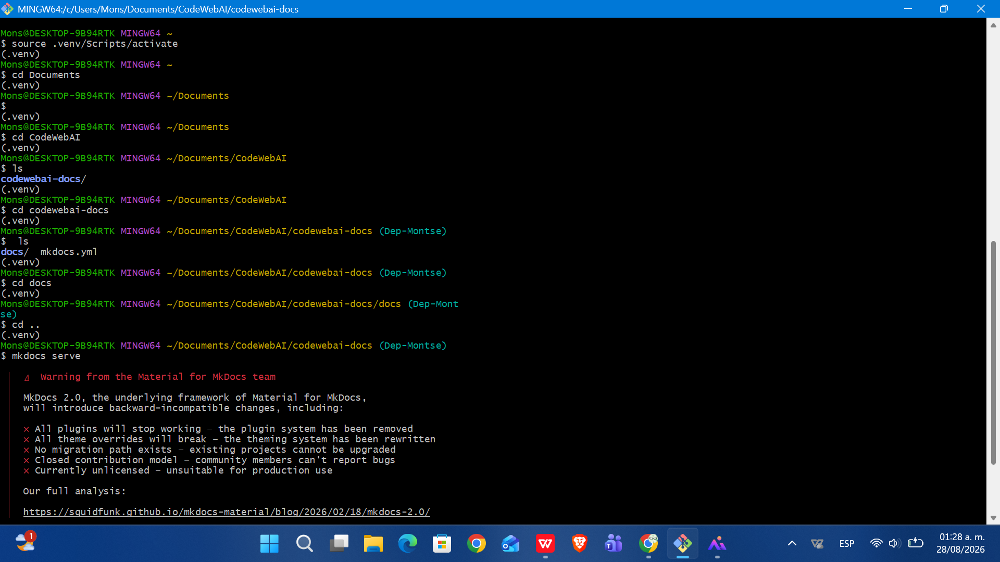

# Incidencias durante la configuracion del entorno de desarrollo y solucion de problemas

Durante la configuración inicial del entorno de desarrollo de CodeWebAI pueden presentarse diferentes incidencias relacionadas con Git, GitHub, Git Bash, Python, Pip, entornos virtuales y MkDocs.

Este apartado tiene como objetivo documentar las principales incidencias y problemas identificadas durante la preparación del entorno de desarrollo, indicando la situación presentada, su posible causa, la solución aplicada y el resultado obtenido.

La documentación de estas incidencias permite facilitar la configuración de nuevos entornos de trabajo y proporcionar una referencia para la resolución de problemas similares.
La aplicacion de configuracion se dio en un sistema operativo Windows.  

## Python/Pip y configuración del entorno de desarrollo.

### 1. Error de **pip** al instalar dependencias

Ejecutaste el comando
``` pip install mkdocs-material 
``` o algun otro comando similar usando pip y te apareció este error


```
Fatal error in launcher: Unable to create process
using '"C:\Python312\python.exe" ...'
```
**Causa**

El error indica que pip estaba intentando utilizar una instalación de Python ubicada en C:\Python312\python.exe, pero no pudo iniciar correctamente dicho ejecutable.

Por lo tanto, el problema esta relacionado con la configuración o asociación entre pip y la instalación de Python utilizada por el sistema.
La causa principal fue la confusión del sistema entre dos versiones de python en este caso el 3.12.

**Solución aplicada**

Para evitar utilizar directamente el ejecutable de pip, se utilizó el lanzador de Python mediante el comando:

``` 
py -m pip install mkdocs

```

Esto permite utilizar explícitamente el intérprete de Python correspondiente al entorno y reducir problemas relacionados con diferentes instalaciones o rutas de Python.

### 2. Error En el entorno Virtual.

Si durante la configuración del proyecto usted intentó crear un entorno virtual de Python utilizando el siguiente comando:

```
python -m venv venv

```

Y posteriormente, quiso activarlo mediante:

```
source venv/Scripts/activate

```

Sin embargo, le muestra el siguiente mensaje:

```
venv/Scripts/activate: No such file or directory

```

Lo que esta observando es que Git Bash no encontró el archivo necesario para activar el entorno virtual en la ubicación especificada.

**Causa**

El registro de configuración no permite determinar con exactitud por qué el primer entorno venv no quedó disponible en la ruta esperada.

Para evitar continuar trabajando con un entorno que no podía ser activado correctamente, se optó por crear nuevamente el entorno utilizando el lanzador de Python.

**Solución aplicada**

Se creó un nuevo entorno virtual con el siguiente comando:

```
py -m venv .venv

```

El entorno se creó utilizando el nombre (.venv), que es una convención común para identificar el entorno virtual asociado a un proyecto.

Entonces el entorno virtual se activa mediante el siguiente comando:

```
source .venv/Scripts/activate

```

Si Git Bash mostró "(.venv)" al inicio de la línea de comandos es porque el entorno virtual se activó correctamente.

!!! note "Recomendación"
    Se recomienda crear y activar un entorno virtual antes de instalar las dependencias específicas del proyecto.

### 3. Error de tema no reconocido en MkDocs

Cuando se intenta iniciar el servidor de documentación mediante

```bash
mkdocs serve
```

MkDocs muestra el siguiente mensaje:

```
ERROR - Config value 'theme': Unrecognised theme name: 'material'.

```

El mensaje indica que MkDocs no pudo reconocer el tema material configurado en el proyecto.

**Causa**

El proyecto utiliza Material for MkDocs como tema para mostrar la documentación.

Sin embargo, el paquete mkdocs-material todavía no esta instalado dentro del entorno de Python utilizado por el proyecto.

Por esta razón, MkDocs reconocía la configuración del proyecto, pero no encontraba el tema material necesario para construir la documentación.

**Solución aplicada**

Primero verifica que el entorno virtual .venv este activado.

Posteriormente, instala el paquete de Material for MkDocs utilizando:

```
py -m pip install mkdocs-material

```

Después de completar la instalación, se debe volver a ejecutar:

```
mkdocs serve

```


Como resultado MkDocs pudo reconocer correctamente el  tema material y construir la documentación.

Finalmente, el servidor local se inició correctamente.

Como se muestra en la imagen:

{: width="460px"}

!!! note "Recomendación"
    Cuando MkDocs muestre un error indicando que el tema material no es reconocido, se debe verificar que Material for MkDocs esté instalado dentro del entorno virtual activo.

    Se recomienda utilizar:

    ```
    py -m pip install mkdocs-material
    ```

    y posteriormente iniciar nuevamente el servidor con:
    
    ```
    mkdocs serve
    ```

!!! note "📌 Importante" 
    Debemos aprender a distinguir **dos conceptos**: 
    
    - `mkdocs` → es el generador de la documentación.
    - `mkdocs-material` → es el paquete que proporciona el tema **Material**.

En la terminal vera una advertencia pero no es necesario realizar ningun cambio, mientras el proyecto actualice la  documentacion se puede trabajar asi. 
